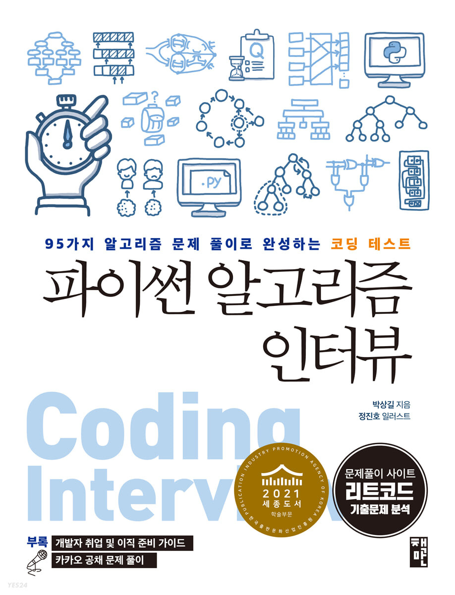

# 파이썬 알고리즘 인터뷰 책 리뷰

  

## 리뷰
IT 대기업에 들어가고 싶은 목표가 있다. 내가 꿈꿔온 회사에서 일하는 사람들의 모습을 보면 멋있다고 생각이 들고 나의 목표에 대한 열망이 강해지는 것 같다.  
미래의 핵심 사업 중 하나인 SW 부분을 이끌고 발전시키는 우리나라의 IT 기업들을 보면서 나도 발자취를 남기고 싶다는 생각이 들고 가슴이 뜨거워지는 것 같다.   
해당 책은 알고리즘에 대한 것이 주요 내용이다. 넓은 주제를 다루고 있고 하나의 문제에도 여러 풀이를 제시해 독자들이 깊게 생각할 수 있도록 유도한다. Computational Thinking 능력을 기르고 싶은 분들에게는 해당 책을 강력히 추천하는 바이다.  
알고리즘에 대한 내용만 기술되어 있는 것이 아니라 파이썬이라는 언어를 사용하는 만큼 언어에 대한 자세한 설명도 기재되어 있다. 컴퓨터 프로그래밍 언어에 대한 이해를 높일 수 있는 기회가 있어 좋았다.  
또한 기업에 대한 설명과 앞으로의 사회 생활에 대한 내용도 있어 좋은 팁들을 얻을 수 있다는 것이 주요한 강점이다.   

## 내가 풀이한 방식들
알고리즘 문제들은 정말 매력적이다. 오랜 시간동안 고민하고 생각을 해서 해결법을 찾았을 때 그 쾌감은 말로 할 수 없을 정도이다.  
해당 저장소에 올린 파이썬 코드들은 책을 참조하지 않고 혼자서 생각하고 해결한 문제들을 올려 책과는 다른 풀이일 것이다.  
문제를 풀고나서는 책의 해결방법들을 보면서 나의 풀이와 비교해보고 검토해보았다.  
비슷한 해결방법들도 있었지만 나만의 독자적인 방식으로 풀이하여 책과는 다른 접근방식이 있어서, 책에 대한 리뷰와 함께 내가 풀이한 코드들을 함께 올린다.  
(언제든지 참조하고 모르는 것이 있으면 저에게 편히 연락주세요.  친절하게 답변하겠습니다.)